# **Tech-Savvy**
## **Site Preview**
### Click here for the live page https://leebri101.github.io/Tech-Savvy/
## Contents-Page:
1. [**Project-Planning**](#project-planning)
    * [**Target Audiences**](#target-audiences)
    * [**User Stories**](#user-stories)
    * [**Site Objectives**](#site-objectives)
    * [**Wire-Frames**](#wire-frames)
1. [**Current Features on all pages**](#current-features-on-all-pages)
    * [**Home-Page:**](#home-page)
        * [*Title*](#title)
        * [*Buttons and Page Navi*](#buttons-and-page-navi)
    * [*About-Page:*](#about-page)
    * [*Skills-Page:*](#skills-page)
        * [*Core-Languages*](#core-languages)
        * [*Advanced Front-End*](#advanced-front-end)
        * [*Back-End*](#back-end)
        * [*Miscellaneous*](#miscellaneous)
    * [*Projects-Page:*](#projects-page)
        * [**](#)
    * [****](#)
    * [****](#)
    * [**Footer**](#footer)
    * [**Typesetting**](#typesetting)
1. [**Potential-Features**](#future-enhancements)
1. [**Deployment**](#deployment)
1. [**Credits**](#credits)
    * [**Honorable mentions**](#honorable-mentions)
    * [**General reference:**](#general-reference)
    * [**Content**](#content)
    * [**Media**](#media)

## **Project Planning**
### **Target Audiences:**
* For potential clients and employers to present to about showcasing my personal portfolio.
* For users who want inspiration for a personal portfolio design.

### **Site Objectives:**
* Allowing users to able use and view projects and get in touch with the owner of the site. 
* To create a simple, effective and user-friendly site which clients and employers can navigate with.

### **User Stories:**
* As a user I want to be able to navigate the website with ease.
* As a user I want to be drawn in with the appearance of the website. 
* As an employer I want to be able to gauge at how much the user has shown their creativity.
* As a client I want to be able to see the work that the owner has done and be able to contact them for a future collaboration. 

### **Wire-Frames:**
* To prevent any digressions towards the project aims & objectives I have made a basic wire-frame via [Figma](https://www.figma.com/file/uAbTphZwZsXFHnrtA8asCY/Welcome-to-FigJam?type=whiteboard&node-id=0%3A1&t=YDDw9WSsovAuHcRM-1) to refer back to in case of any major changes to the project. 

[Wire-frame](doc/wireframe/) were all designed in Figma for a more simpler design.
* [Home Page](doc/wireframe/home.png)
* [About Me Page](doc/wireframe/about.png)
* [Skills Page](doc/wireframe/skills.png)
* [Projects Page](doc/wireframe/projects.png)
* [Contact Page](doc/wireframe/contact.png)

There have been some considerable cosmetic changes to the static site to improve the UX, however most of design was kept to original plan on the wireframes. Some of these changes may include:-
* An interactive carousel at which the user can browse through manually.
* A short automatic image gallery.
* A blended in contact page (subject to change at a later date).
* Some animations on some of teh typography on the pages. 
* An animated background on all pages. 

## **Current Features on all pages**
###  **Home-Page:**
* The home-page will have multiple unique features which the user can do upon navigating which will contain these most notable  features:
    * A linear gradient background.
    * Three CTA(Call To Action) buttons which the user can skip directly specific pages.
    * An automatic image carousel.
    * Wave animation on the footer.

### *Title:*
* The Title will include some unique features:-
    *   The main title of the pages all include an animated logo which was used from interesting insignia from Armored Core VI which eases in upon loading.
    * Also with an animated title which appears and shifts the letters of the title.
    * The page navigation will include an active link which highlights what page the user is on, as well as a hover affect which changes color for the user. 

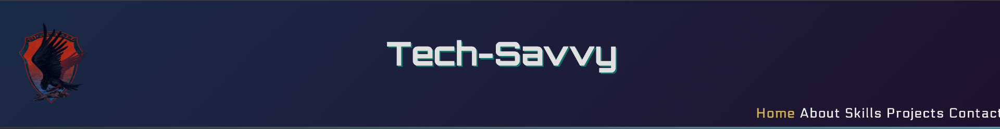

#### *Buttons and Page Navi:*
* The main home page will have 3 separate buttons at which the user can navigate without having to manually click & hover over at page links, the most notable features that have been used :
    * A simple but clean hover over effect where it transitions into a dark navy blue to match the theme of the page.
    * An active page navigation where it allows the user to hover over the different page links and show which page they are currently on.  
    * Direct web-links where it take the user to my GitHub so that they can manually view each of my projects. 
    
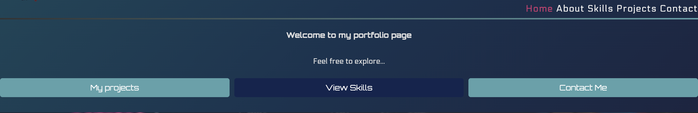
    
* Mobile version of home page with title, icon, buttons and web-links.

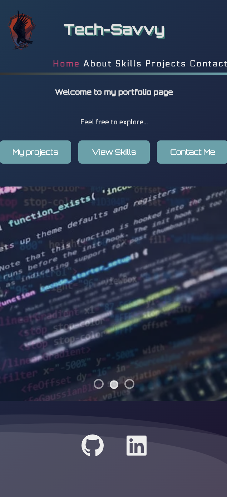

#### *About-Page:*
* Within this part of the page showcases a brief summary of my life and why I went into coding, my educational background, and a personal message. But as a simple design(subject to change) i have included these subtle floating texts boxes that blend in well with the background page.

  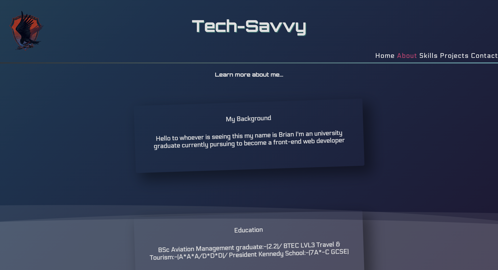

### **Skills-Page:**
* The Skills page shows a rough but honest estimate of my personal skill levels when it comes to coding but it is displayed in a traffic light system (Green = pro-efficient, Amber = Has some knowledge of it, Red = Hasn't learnt/is currently learning) which shows the user my proficiency levels when it comes to coding but it will have a simple design of a manual JavaScript carousel which the user can manually click on which is comprised of these four components:
    ### *Core-Languages:*
    * Comprises of HTML/CSS and JavaScript 

    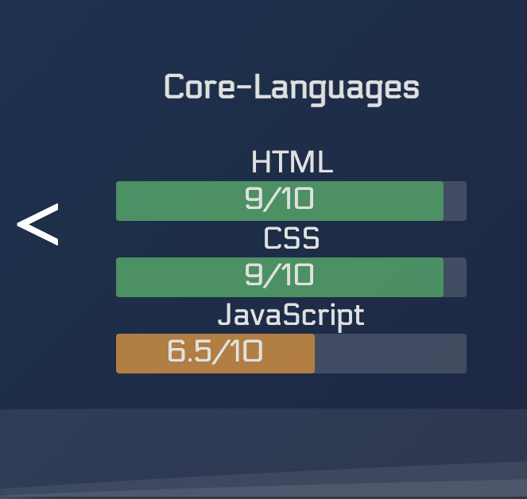

    ### *Advanced Front-End:*
    * Containing React, Redux and Bootstrap

    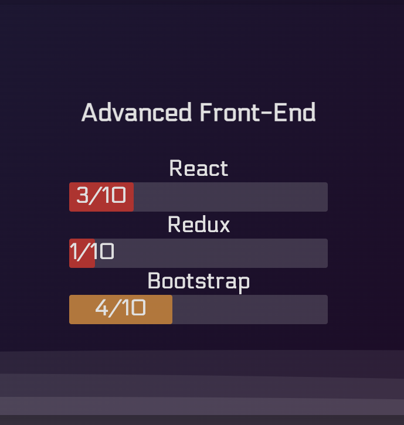
    
    ### *Back-End:*
    * Comprising of Python, REST Django and SQL

    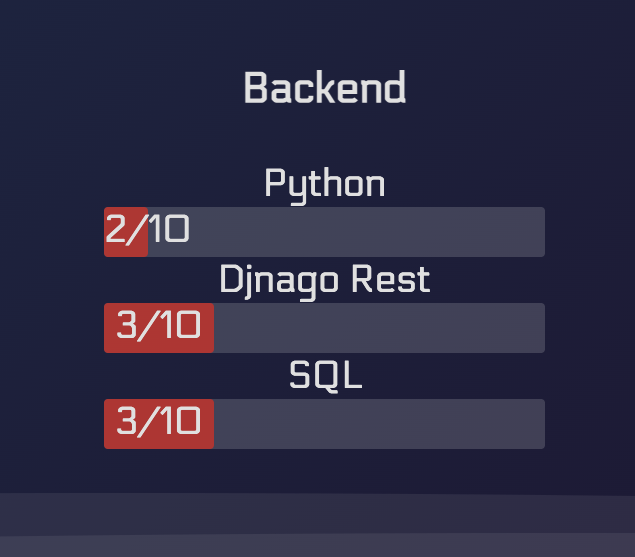

    ### *Miscellaneous:*
    * Other components such as Git/GIthub, Figma/Canva and Miro

    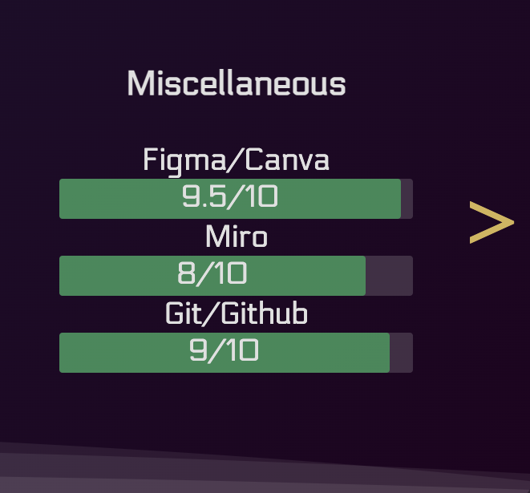

* The user can manually navigate with ease to have a look at my current skill levels all contained in a simple but effect carousel. Each end will have two chevrons at which have a hover effect and turn a sandy gold upon moving the mouse (as seen above in the Miscellaneous image) 

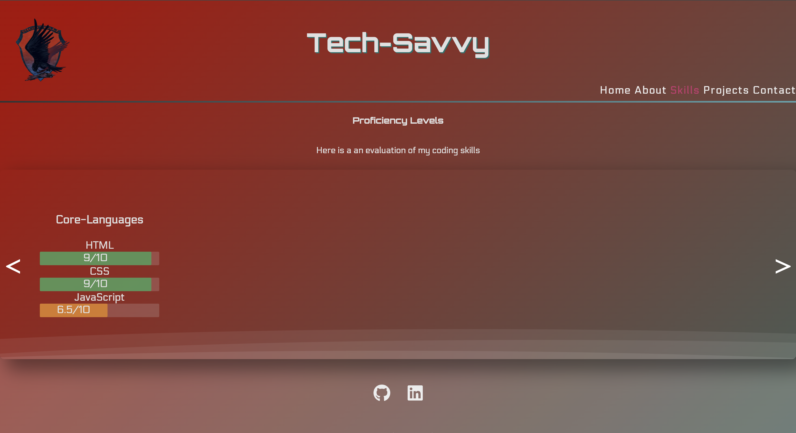

### **Projects-Page**
* The original design of the page was supposed to be within a boxed container within a pyramid scheme of each of the projects at which the user can navigate to which directly sends them to a new tab of each of the projects listed in its respectable links with the inclusion of 2 unique GIFs to display to the user.

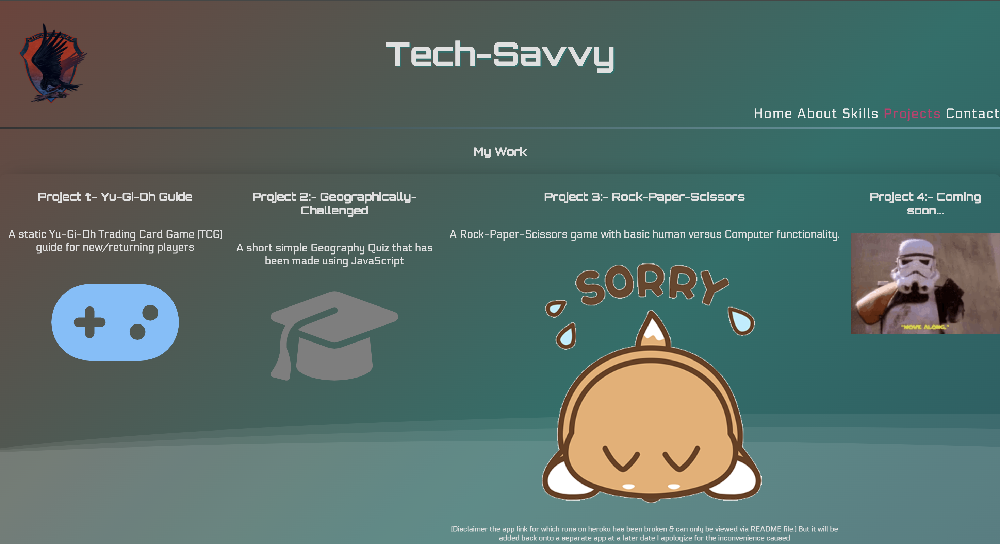

    *  

    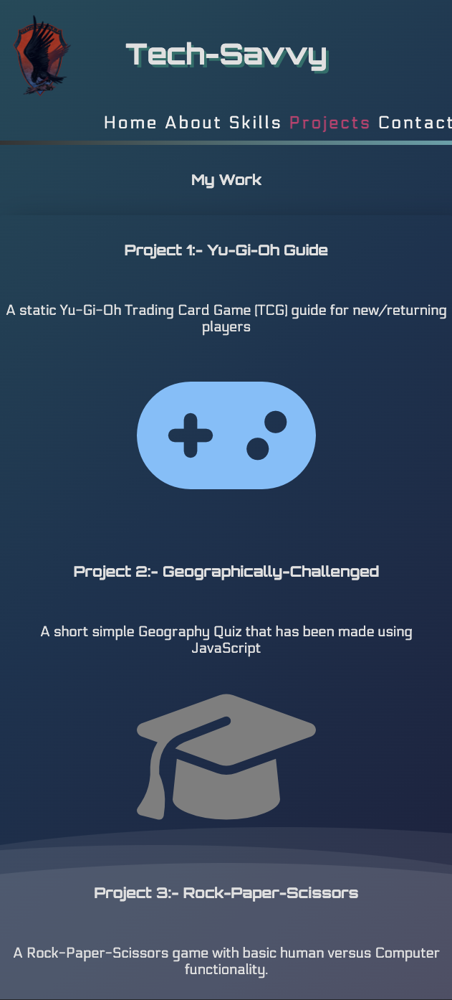

## **Point-Tracker**
* The point tracker is used to display to the user whether they have; answered the question correctly, gave an incorrect answer, did not give answer and to show which answer they are currently on.
* The point tracker is indicated in four different colors:
    * Green: Meaning the user has answered the question correctly.
    * Red: Meaning the user has answered incorrectly.
    * Gray: Meaning the user has ran out of time or can alternatively skip the question.
    * Yellow: To indicate to the user that they are on the current question.

## **Results-Section**
* The results sections shows the following things:
    * The users score out of 10.
    * A feedback message to the user as to whatever associated score they have recieved.
    * A Play Again button if the users wishes to replay the quiz again.

## **Footer**
* All icons that were used in the footer is sourced from font awesome.
* A personal copyright has been added in-case of plagerism.
* A personal link to my GitHub page which users can track my coding journey.

## **Typesetting**
 Throughout the second project milestone only this font was used:
  * Poppins - for a more simplistic look to users so it not too much for them.
* Fonts that have used in the project have been sourced from Google Fonts (quoted in the credits).

## **Potential-Features**
* 
    * An interactive version with sounds and unique animations.
    * Potentially adding a leaderboard system/table to challenge and rival other users.
    * A narration voice over for all the questions and answers for users with disablity issues.
    * A mixture of sound, images and text based questions and answers.
    * A shuffler for answer as well.
    * Different modes within the quiz for example:
        * A speed test to see how quick and accurate the user can answer the questions.
        * Different difficulites in place to challenge the user.
***-->
## **Deployment**
The project has been deployed with the following steps: -

1. Within the project's [repository](https://github.com/leebri101/Tech-Savvy), you select the **Settings** tab.
2. Then select the **Pages** menu tab on the left side.
3. Under **Source** then, select the **Main** branch from the drop-down menu and click **Save**.
4. A message will then pop up that the project has been successfully deployed with a live link.

You can visit the live link via this URL or on the top the README file- [Tech-Savvy](https://leebri101.github.io/Tech-Savvy/)
***

 ## **Credits**
### **Honorable mentions**
This project was a nice refresher for my self to be able to gauge at how much i have improved from when I first started with little to no knowledge of coding to enjoying the challenges it brings me and for giving me the creative freedom to go beyond. However this will be (potentially be) an ongoing static site with a more improvements as i learn new coding languages, as with each coding language that is being covered it will may or may not be potentially be implemented into the project portfolio. But i must credit the following people:
 * John Lamontagne My Coding mentor who is incredible at giving me insight and suggestions on further improving my project and is a huge help to continuously support me for any sort of technical issues within the project.
* My older brother for always being available for being a personal guinea pig for my projects (and as a non-coding person) and (with many more to come) and giving me constant constructive feedback all the time.
### **General reference:**
* The project theme was based around a mixture of my past projects but to create a personal portfolio to showcase to clients and employers.
* I have used W3Schools for a basic understanding and learning process for knowing some basic functionality as a way of reminding some stuff, and for general basic coding references and as general encyclopedia for any code related issues or ideas, some of the designs for the main parts of the page are taken from inspiration from CodePen. 

### **Content:**
* All icons that were used throughout the project are sourced from [Font-Awesome](https://fontawesome.com/)
* All fonts used have been imported from - [Google-Fonts](https://fonts.google.com/)
-->
### **Media:**
* Contact page inspiration [Asana](https://asana.com/sales)
* Favicon generator for index.html: [Favicon-Pro](https://www.favicon.pro/)
* General RGB color Table used in style.css: [RGB-Table](https://www.rapidtables.com/web/color/RGB_Color.html)
* Image compressions: [TinyPNG](https://tinypng.com/) 
* HubSpot for different styling of animations on CSS: [HubSpot](https://blog.hubspot.com/website/css-hover-animation)
* RapidTables for general encyclopedia for searching for color themes: [RapidTables](https://www.rapidtables.com/web/color/RGB_Color.html)
* For the basic and simple wire-frame design as a professional and practical project planning platform [Figma](https://www.figma.com/?fuid=).
* CSS linear gradient animator via CodePen [CodePen](https://codepen.io/baarbaracrr/pen/KKovmGb) 
* Animated slideshow [CodePen](https://codepen.io/mattfried/pen/LJNXVz) 
* Scroll animation [CodePen](https://codepen.io/donovanh/pen/rmzNZJ)  
* Alternative image converter to covertio. [FreeConvert](https://www.freeconvert.com/).
* Image compress/converter [Convertio](https://convertio.co/). 
*  Armored core 6 logo [Armored Core Fandom](https://armoredcore.fandom.com/wiki/ARMORED_CORE_VI_FIRES_OF_RUBICON/Emblems).
* Px to rem/em converter [NekoCalc](https://nekocalc.com/px-to-rem-converter).
* For styling color identifier [Color Hex](https://www.color-hex.com/) 
* Image finder [Unsplash](https://unsplash.com/) 
<!--
